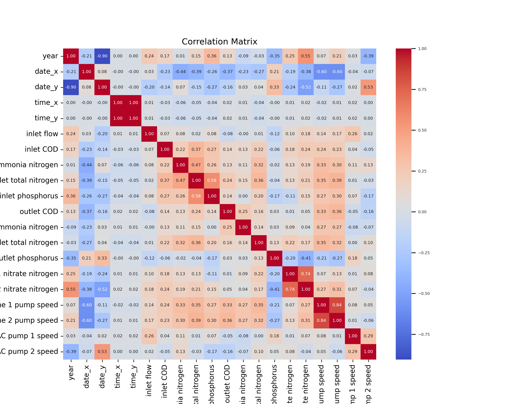
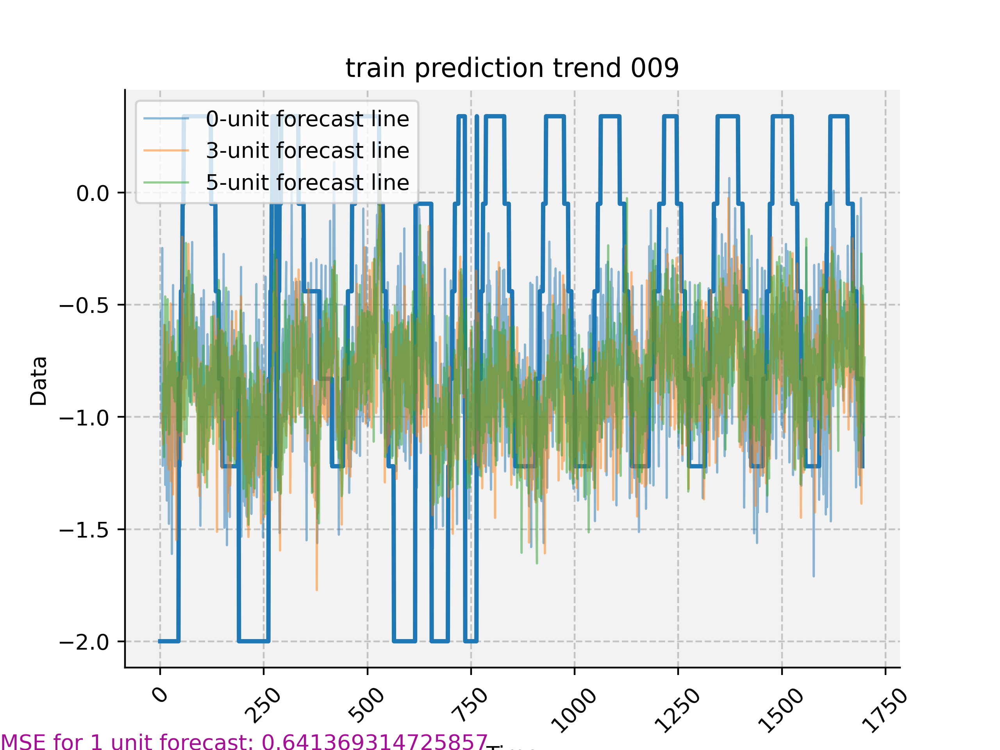
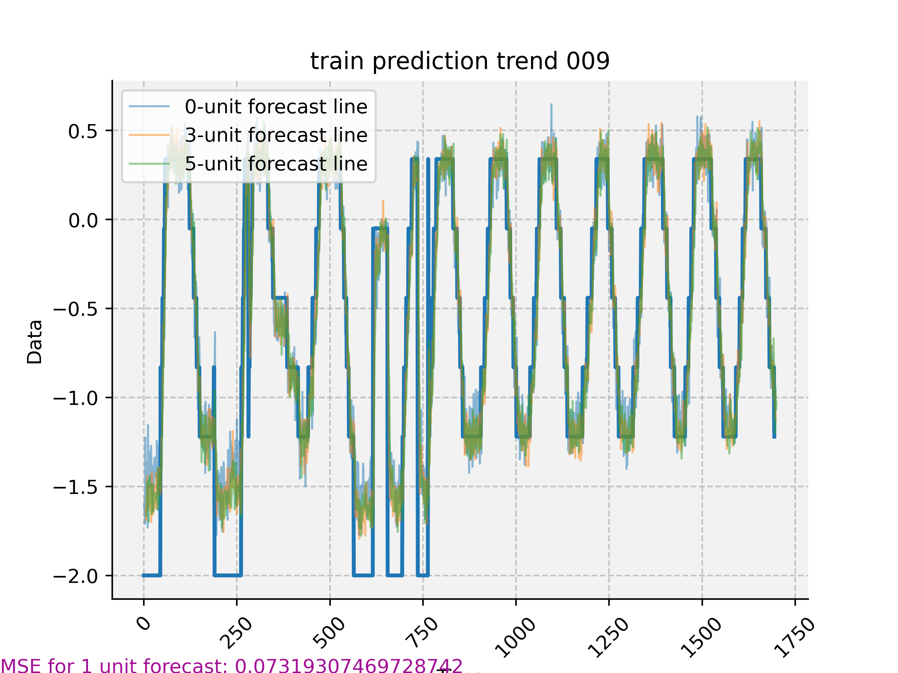
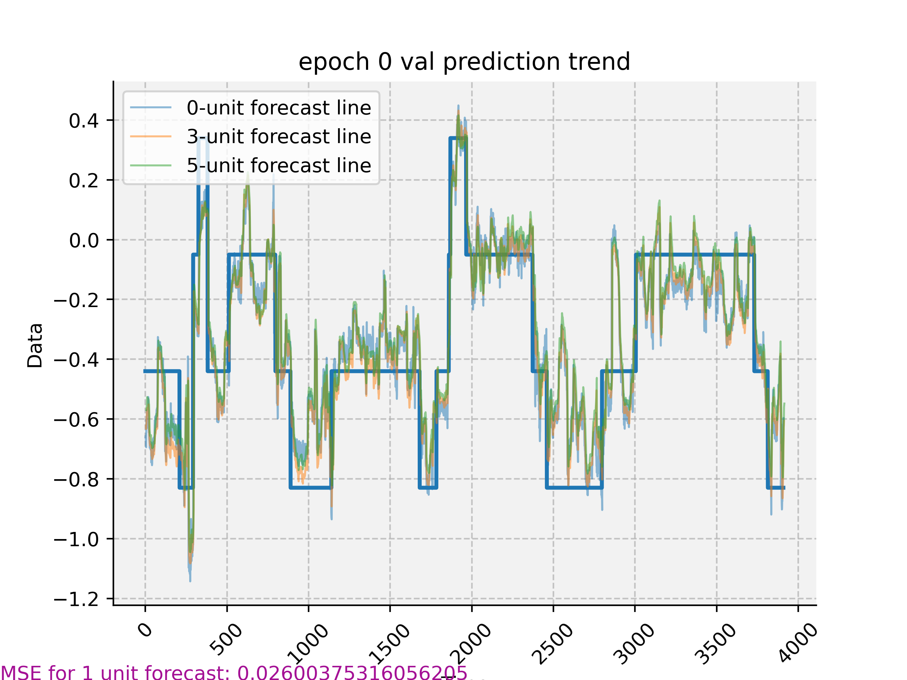
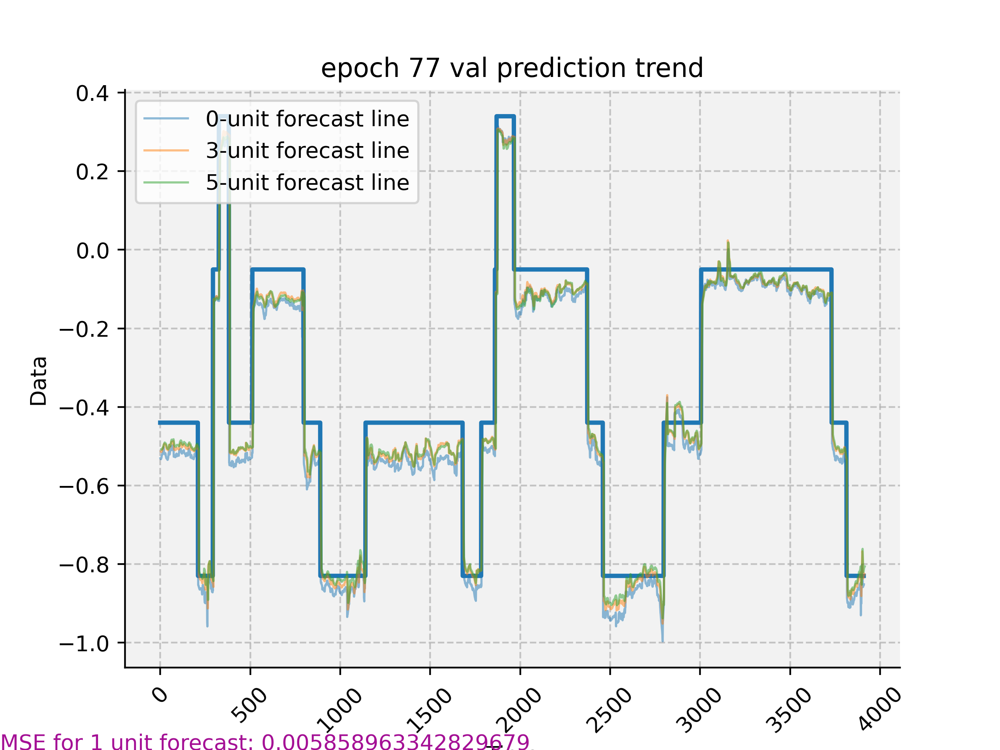

# Transformer for time series data forecasting

**No data included in the repo**. However, it should work fine with most csv data input.

I am considering include the data later when the repo is ready

## If you like this repo, please consider give it a star 

😀

## Usage

Three main things:

- preprocessing.py
- main_transformer_forecast.py
- main_transformer_classifier.py

The fnn is mainly for fun.

The rest of the code are mainly helper

## Training image

Dynamically shows the training process during the training

## Kernel PCA

## Correlation

## Training

### Training start

### Training end

## Validation

### Validation start

### Validation end

## Folder structure

~~~
.
├── config
│   └── config.json
├── data
├── LICENSE
├── model
├── quick_setup_gpu.bash
├── range
│   └── transformer_forecast_512
├── README.md
├── requirements-gpu.txt
├── requirements.txt
├── src
│   ├── da_rnn.py
│   ├── fnn.py
│   ├── helper.py
│   ├── main_dft.py
│   ├── main_efficiency_fore_tester.py
│   ├── main_fnn.py
│   ├── main_kernel_pca.py
│   ├── main_preporcessing.py
│   ├── main_transformer_classifier.py
│   ├── main_transformer_forecast.py
│   ├── png_to_video.sh
│   ├── rotating_donut
│   ├── rotating_donut.c
│   ├── settings.py
│   ├── transformer.py
│   └── utils.py
└── visual
~~~