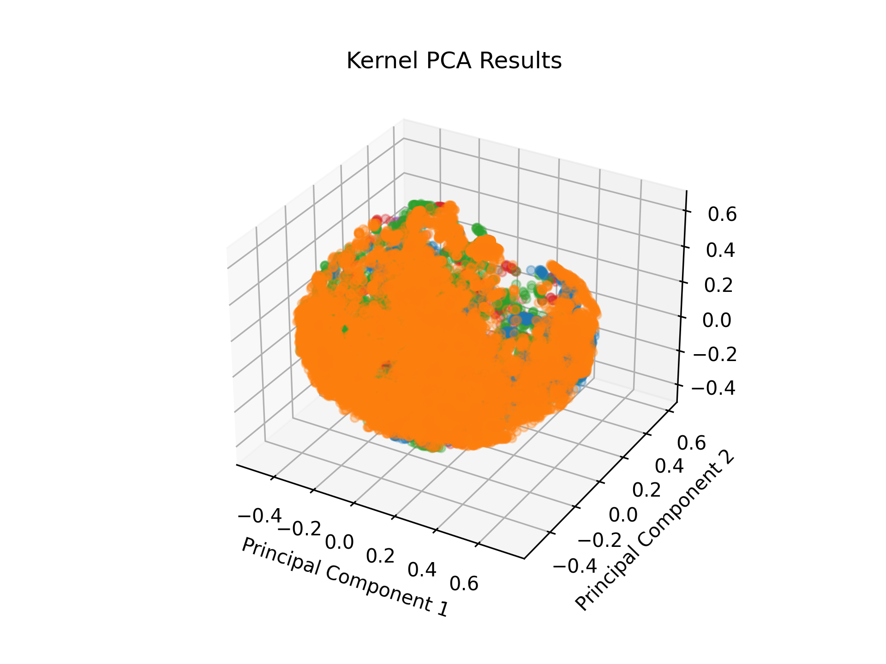
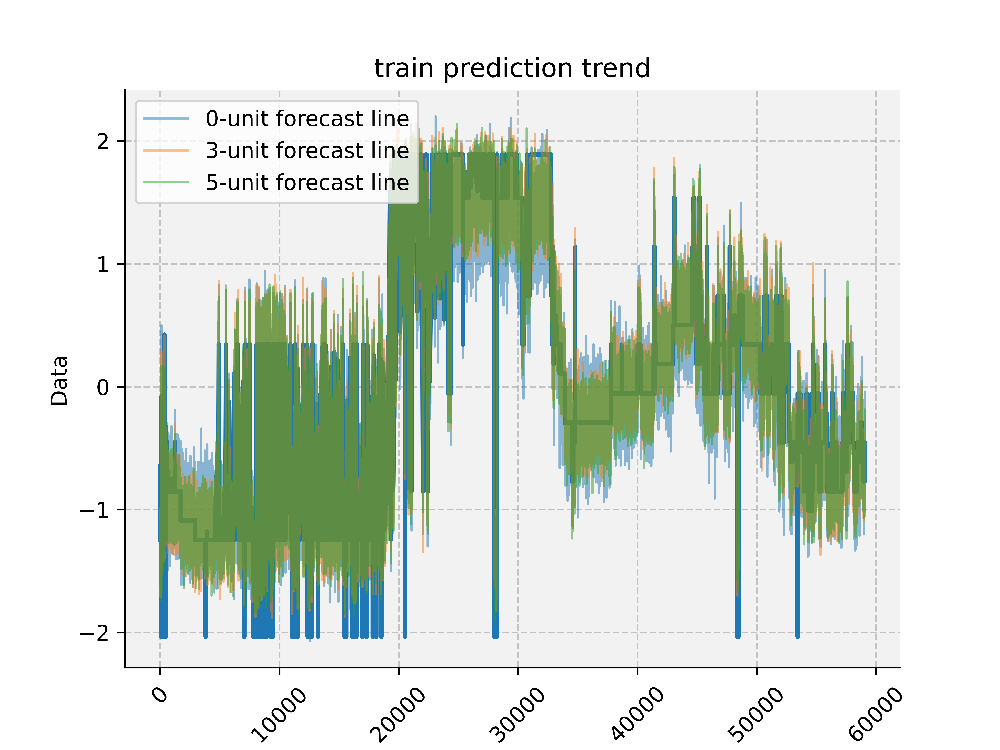

# Transformer for time series data forecasting

No data included in the repo
Should work fine with most csv data input.

## Usage

Three main things:

- preprocessing.py
- main_transformer_forecast.py
- main_transformer_classifier.py

The fnn is mainly for fun.

The rest of the code are mainly helper

## This code should work, I guess

## Training image

Dynamically shows the training process during the training

## Kernel PCA

## Forecast result

