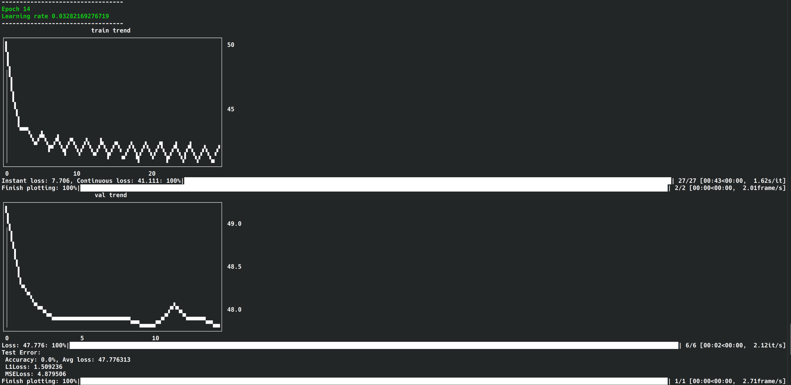

# Transformer for time series data forecasting

**No data included in the repo**. However, it should work fine with most csv data input.

I am considering include the data later when the repo is ready

## If you like this repo, please consider give it a star 

😀

## Usage

Three main things:

- preprocessing.py
- main_transformer_forecast.py
- main_transformer_classifier.py

The fnn is mainly for fun.

The rest of the code are mainly helper

## Training image

Dynamically shows the training process during the training

## Kernel PCA

## Correlation

## Training

### Training start

### Training end

## Validation

### Validation start

### Validation end

